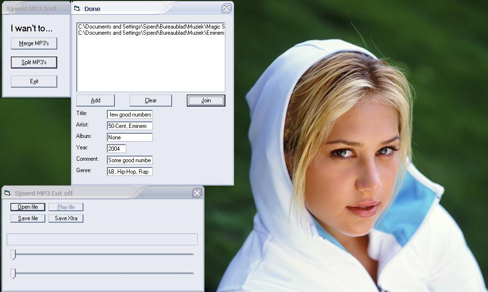



## MP3 Splitter/Merger

### Description

This code can easily merge two or more MP3 files into one.

Also you can split an MP3 to a new MP3, so you can cut out the best pieces of a song and create a new song by using the MP3 Merge function.
 
### More Info
 

             |
---                |---
**Submitted On**   |2004-02-08 19:31:40
**By**             |[Sjoerd](https://github.com/Planet-Source-Code/PSCIndex/blob/master/ByAuthor/sjoerd.md)
**Level**          |Intermediate
**User Rating**    |4.3 (13 globes from 3 users)
**Compatibility**  |VB 5\.0, VB 6\.0
**Category**       |[Sound/MP3](https://github.com/Planet-Source-Code/PSCIndex/blob/master/ByCategory/sound-mp3__1-45.md)
**World**          |[Visual Basic](https://github.com/Planet-Source-Code/PSCIndex/blob/master/ByWorld/visual-basic.md)
**Archive File**   |[MP3\_Splitt170622292004\.zip](https://github.com/Planet-Source-Code/sjoerd-mp3-splitter-merger__1-51593/archive/master.zip)

### API Declarations

Nope

